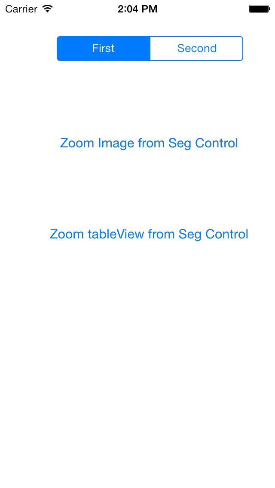
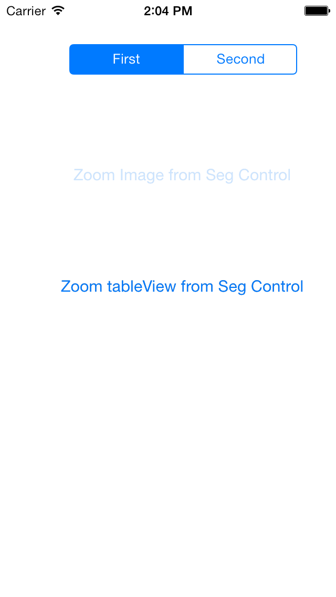
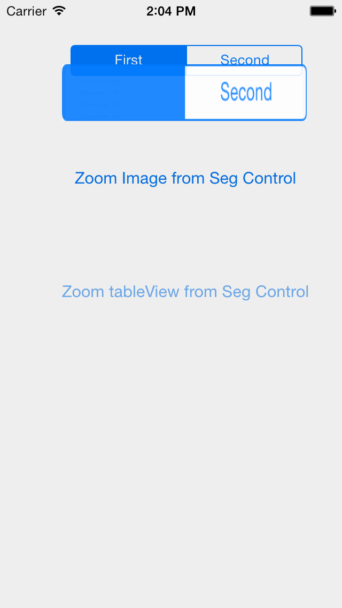
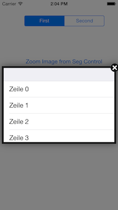

zoomPopup
=========

A popup That zooms out of the underlaying view. The content can be any view, button, image, ... It zooms out in a smooth way and displays the popup above a darkened or blurred background. Even in OSes below iOS 7 ;-) 

In the modern iOS 7 interface the intention of animations is, to clarify the intention and the content. As much as I like the ripple effect ;-) it does´t help the user to understand why and how the content appears.

So one animation you know from the home screen of iOS is, that the app zooms out of the icon. And that´s exactly what the intention of the zoomPopup control is.

It was made in a few hours, so please don´t blame me for the coding. I´ll refactor it as soon as I have time ;-)

The test app is very simple. It creates a dummy tableview and shows it in a popup while the background is dimmed. 

    UITableView *table = [[UITableView alloc] initWithFrame:CGRectMake(50, 50, 300, 200) style:UITableViewStyleGrouped];
    table.dataSource=self;
    
    [zoomPopup initWithMainview:self.view andStartRect:_segmentedControl.frame];
    [zoomPopup showPopup:table];

In this first example I used the singleton approach to call the zoomPopup, which is the easiest way.

The sec on example creates a zoomPopup instance and then loads an image and shows it with a blurred background

    UIImageView *image = [[UIImageView alloc] initWithImage:[UIImage imageNamed:@"myAn"]];
    
    zoomPopup *popup = [[zoomPopup alloc] initWithMainview:self.view andStartRect:_segmentedControl.frame];
    [popup setBlurRadius:10];
    [popup showPopup:image];

### Authors and Contributors
So, I (@Tintenklecks) had the need, the idea and realized it as it is now ;-)

Thanks to Thomas @tomsoft1, I included the blur effect as well (https://github.com/tomsoft1)

### Support or Contact
Having trouble with Pages? Check out the documentation at http://help.github.com/pages or contact support@github.com and we’ll help you sort it out.
